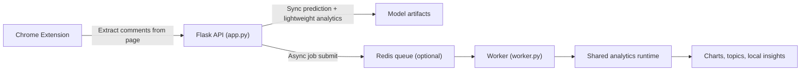

# YouTube Sentiment MLOps Pipeline

A production-style YouTube comment sentiment platform with:

- a DVC-managed training pipeline
- a Flask inference and analytics API
- a Chrome extension frontend
- async analytics jobs with local fallback or Redis-backed worker execution
- structured logging, readiness checks, metrics, retries, and dead-letter handling

This repo now behaves more like a real service than a notebook demo: the extension extracts comments directly from the YouTube page, the backend performs local-only analytics, and heavy workloads can run asynchronously through a queue-backed worker model.

## What It Does

The project has two major parts.

1. Training pipeline
- ingest and split data
- preprocess text
- train a LightGBM sentiment model
- evaluate and register artifacts

2. Product runtime
- fetch comments from the YouTube page in the Chrome extension
- send comments to the Flask API
- score sentiment with the saved model
- generate insights, topics, charts, and topic-level sentiment
- run heavy analytics as background jobs

## Current Architecture



Local development without Redis still works: the app falls back to an in-process async executor so tests and simple runs stay easy.

## Project Structure

```text
.
├── app.py
├── analytics_runtime.py
├── worker.py
├── docker-compose.yml
├── Dockerfile
├── requirements.txt
├── tests/
│   └── test_app.py
├── flask_api/
│   └── main.py
├── src/
│   ├── data/
│   │   ├── data_ingestion.py
│   │   └── data_preprocessing.py
│   └── model/
│       ├── model_building.py
│       ├── model_evaluation.py
│       └── register_model.py
├── yt-chrome-plugin-frontend/
│   ├── manifest.json
│   ├── popup.html
│   └── popup.js
└── dvc.yaml
```

## Main Features

- sentiment prediction for comment batches
- sentiment distribution chart generation
- word cloud generation
- keyword chart generation
- topic extraction
- topic sentiment clustering
- local-only insight summaries
- async background job submission and polling
- retries and dead-letter handling for worker jobs
- health, readiness, and metrics endpoints

## API Overview

### Core endpoints

- `GET /health`
- `GET /livez`
- `GET /readyz`
- `GET /metrics`
- `POST /predict_with_timestamps`
- `POST /generate_chart`
- `POST /generate_wordcloud`
- `POST /generate_keyword_chart`
- `POST /generate_trend_graph`
- `POST /extract_topics`
- `POST /generate_insights`
- `POST /topic_sentiment`

### Async job endpoints

- `POST /jobs/insights`
- `POST /jobs/topics`
- `POST /jobs/topic-sentiment`
- `POST /jobs/wordcloud`
- `POST /jobs/keyword-chart`
- `POST /jobs/trend-graph`
- `GET /jobs/<job_id>`
- `GET /jobs/<job_id>/artifact`

### Admin endpoints

- `GET /admin/jobs/dead-letter`
- `POST /admin/jobs/<job_id>/replay`

The admin endpoints require the Redis backend. In local fallback mode they intentionally return `409`.

## Training Pipeline

The ML pipeline is orchestrated through [dvc.yaml](C:\Users\Slim-5\Desktop\youtube-sentiment-mlops-pipeline\dvc.yaml).

Stages:

1. `src/data/data_ingestion.py`
2. `src/data/data_preprocessing.py`
3. `src/model/model_building.py`
4. `src/model/model_evaluation.py`
5. `src/model/register_model.py`

Artifacts produced by the pipeline include:

- `lgbm_model.pkl`
- `tfidf_vectorizer.pkl`
- `experiment_info.json`
- `reports/data_quality/ingestion_report.json`
- `reports/data_quality/preprocessing_report.json`
- `reports/model/evaluation_metrics.json`
- `reports/model/model_comparison.json`

## Building A Better YouTube Dataset

The repo now supports a local YouTube-style labeled dataset at [data\external\youtube_comments_labeled.csv](C:\Users\Slim-5\Desktop\youtube-sentiment-mlops-pipeline\data\external\youtube_comments_labeled.csv).

Current state:

- this file is a seed dataset for offline development
- the ingestion pipeline will prefer it automatically when present
- if it is missing, ingestion falls back to the remote baseline dataset URL in [params.yaml](C:\Users\Slim-5\Desktop\youtube-sentiment-mlops-pipeline\params.yaml)

The fastest way to improve model quality now is to expand that local file with real labeled YouTube comments.

### Prepare comments for labeling

If you have raw exported comments in `data.json`, run:

```powershell
.\scripts\tasks.ps1 labeling-queue
```

This creates:

- `data/external/youtube_comments_labeling_queue.csv`
- `reports/data_quality/dataset_curation_report.json`

The queue now also:

- skips comments that already exist in the labeled dataset
- assigns `batch_id` values for larger labeling sessions
- can attach `suggested_label` and `suggested_confidence` from the current trained model
- keeps `labeler_notes` for manual review context
- ranks rows with `review_priority_rank`, `review_priority_score`, and `review_priority_reason`

You can also run the curation script directly on JSON or CSV input:

```powershell
.\.venv\Scripts\python.exe src\data\dataset_curation.py prepare `
  --input data.json `
  --output data\external\youtube_comments_labeling_queue.csv `
  --dataset-name youtube_capture
```

The generated labeling queue includes:

- `comment_text`
- `sentiment_label`
- `source_dataset`
- `needs_review`
- `example_id`
- `batch_id`
- `suggested_label`
- `suggested_confidence`
- `labeler_notes`
- `review_priority_rank`
- `review_priority_score`
- `review_priority_reason`

### Bootstrap weak labels

If you want a triage set from high-confidence model suggestions, run:

```powershell
.\scripts\tasks.ps1 labeling-bootstrap
```

This creates `data/external/youtube_comments_pseudo_labeled.csv`.

Important guardrail:

- this file is weakly labeled and should stay separate from your gold human-labeled dataset until reviewed
- use it to prioritize review, not as a blind replacement for manual labeling

### Prioritize what to label first

The labeling queue is now ranked automatically:

- lower-confidence model suggestions get higher review priority
- neutral and ambiguous items are weighted slightly higher because they are often harder decision boundaries
- each row gets a `review_priority_rank` so you can work top-down instead of sampling randomly

### Merge newly labeled data

After manually filling `sentiment_label` with `positive`, `neutral`, or `negative`, merge the new examples into the training dataset:

```powershell
.\.venv\Scripts\python.exe src\data\dataset_curation.py merge `
  --base data\external\youtube_comments_labeled.csv `
  --new data\external\youtube_comments_labeling_queue.csv `
  --output data\external\youtube_comments_labeled.csv
```

### Audit the labeled dataset

Before retraining, run a quick QA audit:

```powershell
.\scripts\tasks.ps1 labeling-audit
```

This checks for:

- invalid labels
- duplicate comments
- empty comments
- class imbalance

### Retrain and compare

Once the dataset is updated, rerun the ML pipeline and inspect:

- [reports\model\evaluation_metrics.json](C:\Users\Slim-5\Desktop\youtube-sentiment-mlops-pipeline\reports\model\evaluation_metrics.json)
- [reports\model\model_comparison.json](C:\Users\Slim-5\Desktop\youtube-sentiment-mlops-pipeline\reports\model\model_comparison.json)

The comparison report checks the candidate model against [reports\model\baseline_metrics.json](C:\Users\Slim-5\Desktop\youtube-sentiment-mlops-pipeline\reports\model\baseline_metrics.json) using the promotion thresholds from [params.yaml](C:\Users\Slim-5\Desktop\youtube-sentiment-mlops-pipeline\params.yaml).

If the comparison report recommends promotion, you can update the baseline report with:

```powershell
.\scripts\tasks.ps1 promote-baseline
```

## Running Locally

### Option 1: simple local app run

This uses the local async fallback and does not require Redis.

```powershell
.\.venv\Scripts\python.exe app.py
```

### Option 2: scaled local stack with Redis and worker

```powershell
docker compose up --build
```

This starts:

- `redis`
- `web`
- `worker`

### Option 3: task runner shortcuts

```powershell
.\scripts\tasks.ps1 api
.\scripts\tasks.ps1 stack
.\scripts\tasks.ps1 worker
.\scripts\tasks.ps1 test
.\scripts\tasks.ps1 test-unit
.\scripts\tasks.ps1 test-redis
.\scripts\tasks.ps1 labeling-queue
.\scripts\tasks.ps1 labeling-bootstrap
.\scripts\tasks.ps1 labeling-audit
.\scripts\tasks.ps1 promote-baseline
```

## Environment Variables

Important runtime settings:

- `HOST`
- `PORT`
- `DEBUG`
- `LOG_LEVEL`
- `REQUEST_TIMEOUT_SECONDS`
- `MAX_COMMENTS_PER_REQUEST`
- `MAX_COMMENT_LENGTH`
- `REDIS_URL`
- `JOB_QUEUE_NAME`
- `DEAD_LETTER_QUEUE_NAME`
- `MAX_JOB_ATTEMPTS`
- `JOB_TTL_SECONDS`
- `YOUTUBE_API_KEY`

Notes:

- the extension now extracts comments directly from the page, so the normal user path does not require YouTube API fetches
- `YOUTUBE_API_KEY` is still relevant if you want the legacy `/get_youtube_comments` endpoint
- local insights do not use paid LLM APIs

## Demo Requests

### Predict sentiment for comments

```powershell
curl -X POST http://localhost:5000/predict_with_timestamps `
  -H "Content-Type: application/json" `
  -d "{\"comments\":[{\"text\":\"Great explanation\",\"timestamp\":\"2026-03-31T00:00:00Z\"},{\"text\":\"Bad audio quality\",\"timestamp\":\"2026-03-31T00:01:00Z\"}]}"
```

Example response:

```json
[
  {
    "comment": "Great explanation",
    "sentiment": 1,
    "timestamp": "2026-03-31T00:00:00Z"
  },
  {
    "comment": "Bad audio quality",
    "sentiment": -1,
    "timestamp": "2026-03-31T00:01:00Z"
  }
]
```

### Submit an async insights job

```powershell
curl -X POST http://localhost:5000/jobs/insights `
  -H "Content-Type: application/json" `
  -d "{\"comments\":[\"great tutorial\",\"very useful examples\",\"audio could be better\"]}"
```

Example response:

```json
{
  "job_id": "1234-example",
  "job_type": "insights",
  "status": "queued",
  "status_url": "/jobs/1234-example",
  "artifact_url": null
}
```

### Poll a job

```powershell
curl http://localhost:5000/jobs/<job_id>
```

## Chrome Extension Flow

The extension in [yt-chrome-plugin-frontend](C:\Users\Slim-5\Desktop\youtube-sentiment-mlops-pipeline\yt-chrome-plugin-frontend) does the following:

1. detect the current YouTube video
2. scrape visible comments from the page using `chrome.scripting`
3. send comments to the backend
4. request async analytics jobs
5. poll job status endpoints
6. render insights, topics, and charts in the popup

## Observability

The service includes:

- structured JSON logs
- request IDs
- liveness and readiness endpoints
- Prometheus-compatible `/metrics`
- request latency and count metrics
- async job counters and duration metrics
- Redis queue depth metrics when Redis is active

Useful endpoints:

```text
GET /health
GET /readyz
GET /metrics
```

## Retry And Dead-Letter Runbook

### Job lifecycle

A job can move through:

- `queued`
- `running`
- `completed`
- `failed`

Tracked metadata includes:

- `attempts`
- `max_attempts`
- `dead_lettered`

### What happens on failure

- local fallback backend retries in-process until `MAX_JOB_ATTEMPTS`
- Redis worker requeues failed jobs until `MAX_JOB_ATTEMPTS`
- once the final attempt fails, the worker marks the job as failed and pushes the original message to the dead-letter queue

### Inspect dead-letter jobs

```text
GET /admin/jobs/dead-letter
```

Example:

```powershell
curl http://localhost:5000/admin/jobs/dead-letter
```

### Replay a dead-letter job

```text
POST /admin/jobs/<job_id>/replay
```

Example:

```powershell
curl -X POST http://localhost:5000/admin/jobs/<job_id>/replay
```

### Readiness expectations

`/readyz` reports:

- model readiness
- vectorizer readiness
- job backend in use
- whether Redis is healthy when Redis mode is active
- max configured job attempts

## Testing

Run tests locally with:

```powershell
.\.venv\Scripts\python.exe -m unittest discover -s tests -v
```

Current tests cover:

- health and readiness
- structured validation errors
- async JSON jobs
- async artifact jobs
- retry-before-success
- dead-letter behavior on permanent failure
- admin endpoint behavior in non-Redis mode

## CI

GitHub Actions CI lives in [ci.yml](C:\Users\Slim-5\Desktop\youtube-sentiment-mlops-pipeline\.github\workflows\ci.yml) and runs:

- dependency installation
- unit tests on Python 3.11

## Known Gaps

- the model training data and production YouTube domain are still not perfectly aligned
- the included YouTube labeled dataset is still only a seed dataset, not a production-scale corpus
- Redis-backed worker flow is implemented, but this repo still needs Redis integration tests
- queue dashboards and dead-letter replay tooling are API-first, not UI-first
- the ML evaluation path can still be expanded with stronger model governance and drift monitoring

## Why This Is Stronger Now

Compared with the earlier version, this repo now demonstrates:

- modular ML training
- backend production hardening
- async service design
- worker separation
- queue reliability patterns
- operational recovery flows
- test and CI discipline

That makes it much more credible as a FAANG-style systems-and-ML portfolio project.
